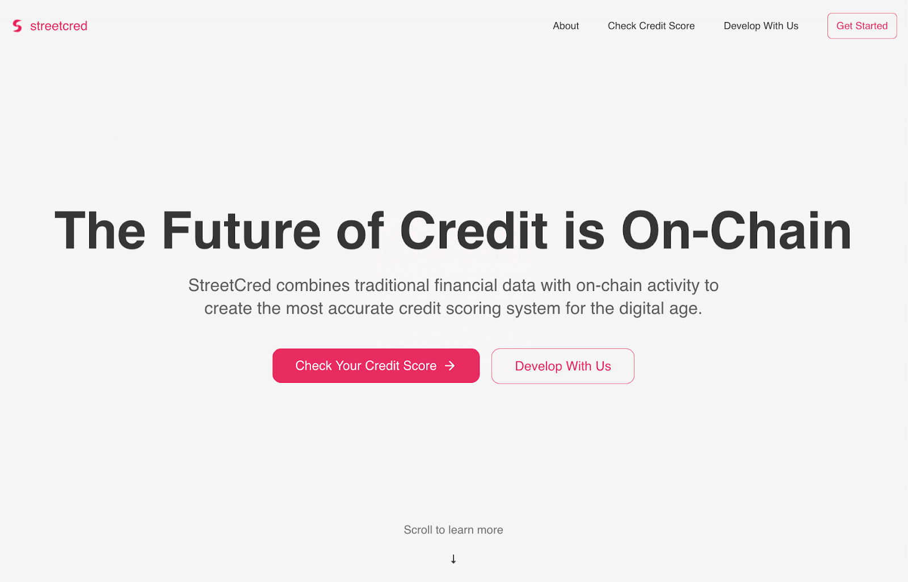
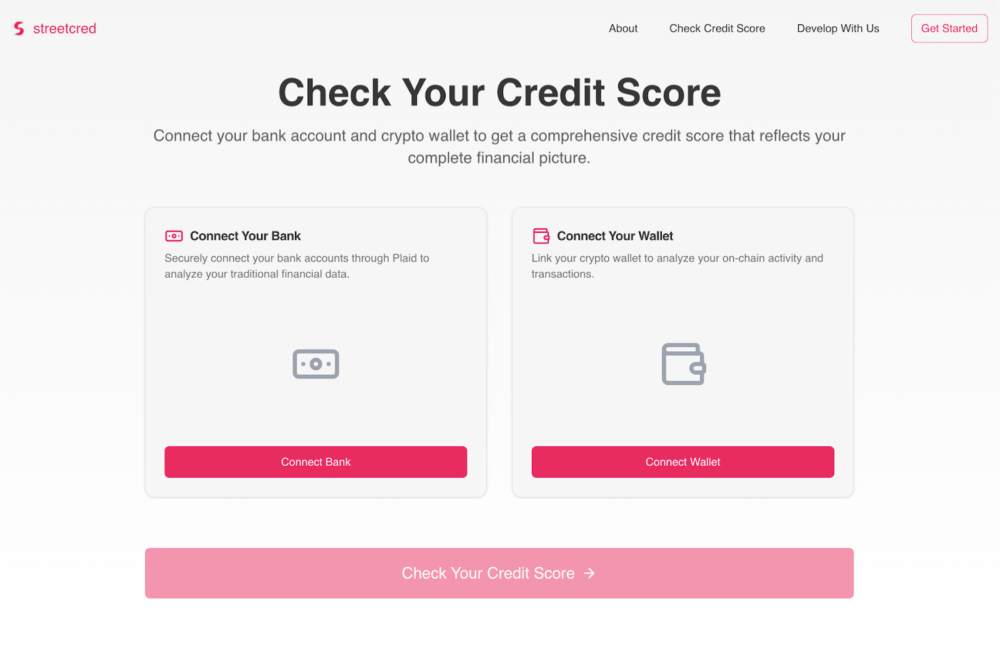
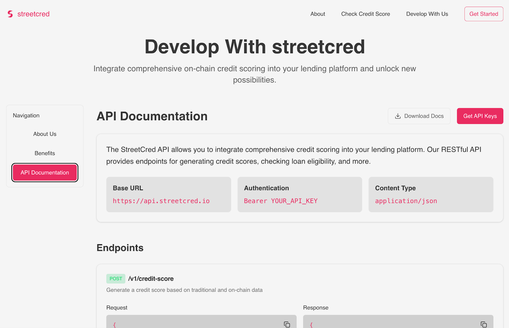

# StreetCred – AI-Powered Credit Scoring for DeFi

## Overview

StreetCred is a **secure, AI-driven credit scoring platform** designed to lower collateral requirements for DeFi lending. By combining **on-chain** and **off-chain** financial data, computed within a **Trusted Execution Environment (TEE)**, and is completely secured through **Transport Layer Security (TLS)** StreetCred provides a **verifiable and privacy-preserving credit score** that improves capital efficiency.

## Check Your Credit Score

Connect your bank account and crypto wallet to get a comprehensive credit score that reflects your complete financial picture.

### Connect Your Data
- **Connect Your Bank**: Securely connect your bank accounts through Plaid to analyze your traditional financial data.
- **Connect Your Wallet**: Link your crypto wallet to analyze your on-chain activity and transactions.

## Platform Features

StreetCred is now a full-fledged web platform with two key functionalities:

1. **User Credit Scoring** – Individuals can connect their **crypto wallets** and **bank accounts** to receive an AI-powered credit score.
2. **Lending Provider Integration** – DeFi lending platforms can integrate StreetCred's credit scoring API to offer loans with reduced collateral requirements.

## How It Works

1. Users Connect Wallets and Bank Accounts securely through the website.
2. TEE Fetches Off-Chain Data via Plaid API while ensuring data security.
3. Gemini AI Analyzes Financial Data, summarizing income and spending behavior.
4. TEE Reads On-Chain Transactions to assess DeFi activity and repayment history.
5. TEE Computes the Credit Score, factoring in both datasets.
6. TLS Encryption Protects All Data throughout the entire process.
7. The Score is Provided to users and integrated into DeFi lending platforms.

## Technology Stack

- **Frontend**: Web Platform (React/JavaScript/Next.js)
- **Backend**: Python (TEE enclave computation)
- **TEE Provider**: Google Cloud
- **Blockchain Querying**: Direct RPC Calls
- **Off-Chain Banking Data**: Plaid API
- **AI Processing**: Gemini AI
- **Security**: RA-TLS

## Future Plans

Our next phase focuses on onboarding DeFi lending providers to integrate StreetCred's technology, enabling lower collateral requirements for users. As adoption grows, we aim to expand to multi-chain support and incorporate more financial data sources to refine risk assessment models.

StreetCred is paving the way for a more accessible and efficient DeFi lending ecosystem.

## Demo

Check out our live demo: [FlareX Demo](https://www.youtube.com/watch?v=2PkIWE-DfK0)
